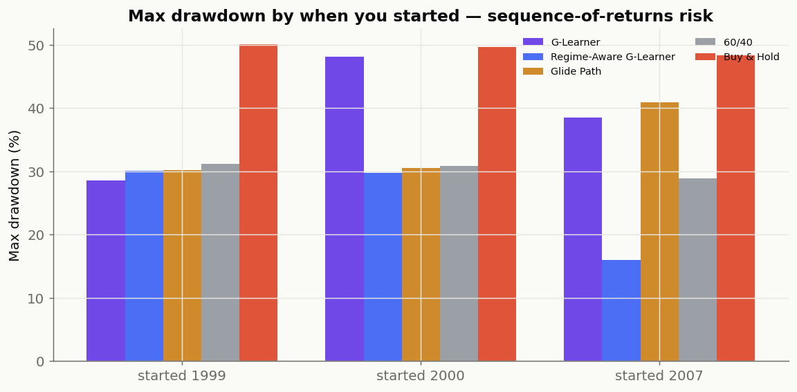

# Real-World Validation — *"If you had deployed this in 1999"*

> Does goal-based reinforcement learning actually help in the real world, or only
> in a tidy simulation? This document answers that with **real** market history
> across US and Asian markets, with **no look-ahead**, and shows the decisions the
> agent would have made — month by month — through the dot-com crash, the Global
> Financial Crisis, COVID and the 2022 selloff.

Reproduce everything here with:

```bash
python scripts/historical_demo.py            # tables + figures below
gbwm history --market sp500 --start 1999-01-01
gbwm history --market kospi  --start 1999-01-01
streamlit run app/streamlit_app.py           # tab: "🕰️ Time machine (1999→today)"
```

*Educational simulation — single risky asset, monthly rebalancing, costs/taxes
simplified. Not financial advice. Numbers are as-of the latest data pull; rankings
are stable.*

---

## 1. Why the first real-data attempt was misleading

The repo already had a "Real markets" demo, but it quietly did three things that
made it **prove nothing**:

1. **Look-ahead bias.** It fit the market "regimes" (the bull/stable/high-vol/bear
   parameters) on the **whole** realized path — including the future. An investor
   in 1999 could not know those. The fitted "bull" regime came out at *+90%/yr* —
   a number you only get by peeking at the answer.
2. **The wrong yardstick.** It ranked strategies by **terminal wealth**. On a
   single market that *happened to rise*, that just rewards whoever held the most
   stocks — so plain Buy & Hold "won" and the RL agent looked *worse*. That is the
   opposite of the point.
3. **A trivially easy goal.** Over 25+ years with monthly contributions, a
   \$250k goal is reached by *everyone*, so nothing is differentiated.

The fix is to be **honest** and to **measure what goal-based investing is actually
about**: reaching the goal *without a gut-wrenching crash that makes real people
sell at the bottom*.

## 2. The honest method (no look-ahead)

| Ingredient | How it stays honest |
|---|---|
| **Regimes** | Use the four **economic-prior** regimes from the config (assumptions you could write down on day one), **not** parameters fitted to the realized path. |
| **Regime detection** | The agent classifies each month with the **online Bayes belief filter**, using **only past** returns. |
| **Roll-out** | Solve the policy once, then walk **forward** through the **actual** month-by-month returns of a real index. |
| **Yardstick** | Report **max drawdown**, worst 12-month, and goal attainment — not just terminal wealth. |

This is implemented in `src/gbwm/backtesting/historical.py` and reuses the same
validated core (`run_on_returns`, the belief filter, the G-Learner). The
no-look-ahead property is enforced by a behavioral test
(`tests/test_historical.py::test_belief_is_causal_no_anticipation_of_a_crash`):
the agent's "bad weather" belief **does not rise before** a crash, only after.

## 3. Headline: the S&P 500, deployed January 1999

Plan: start \$100,000, add \$500/month, goal \$600,000, ride it to the end of 2025
(27 years). Same plan for every strategy, on the **same real history**.

| Strategy | Final balance | Reached goal | **Max drawdown** | Worst 12-month |
|---|---:|:--:|---:|---:|
| G-Learner (goal-based RL) | \$642k | ✅ | **13%** | −11% |
| Regime-Aware G-Learner | \$646k | ✅ | **19%** | −14% |
| 60/40 | \$887k | ✅ | 31% | −26% |
| Glide Path | \$707k | ✅ | 36% | −29% |
| Buy & Hold | \$1,233k | ✅ | **50%** | −42% |

**Read the drawdown column.** Buy & Hold ends richer — but only by living through a
**50% crash** (twice). The goal-based RL agents reach the same goal with **a third
of the drawdown**. That is the real-world value: you arrive, *without* watching half
your savings evaporate right before you need them.


*Top: every plan on the same real history, crisis windows shaded. Middle: the
smart agent dials its stock exposure up and down while Buy & Hold never moves.
Bottom: the agent's real-time "bad weather" belief — P(bear)+P(high-vol),
computed from past returns only — spiking into each crash.*

### What the agent did at the turning points (its "decision diary")

- **Dot-com crash** (Mar 2000–Sep 2002): the market fell −46%. Buy & Hold rode it
  down (−40%). The regime-aware agent's bad-weather belief peaked at **81%** and it
  cut equity from **52% → 29%**.
- **Global Financial Crisis** (Oct 2007–Feb 2009): the market fell −53%. Buy & Hold
  −50%. The agent's belief peaked at **90%** and it cut equity **65% → 25%**.
- **COVID-19** (Feb–Mar 2020): a −34% crash in *one month* — too fast for a monthly
  strategy to fully dodge; the agent still trimmed **41% → 34%**.
- **2022 inflation bear**: market −25%; belief peaked at 81%; equity cut **40% → 28%**.

Nobody coded these reactions. They fall out of the learned, goal-based, regime-aware
policy responding to a belief it forms *online* from realized returns.

## 4. Same plan, different world markets (deployed ~1999)

| Market | Buy & Hold final / drawdown | Regime-Aware final / drawdown |
|---|---:|---:|
| **S&P 500** (US) | \$1,233k / **50%** | \$646k / **19%** |
| **NASDAQ** (US tech) | \$2,199k / **71%** | \$989k / **26%** |
| **KOSPI** (S. Korea) | \$1,212k / **49%** | \$642k / **14%** |
| **Nikkei 225** (Japan) | \$921k / **55%** | \$627k / **22%** |

The pattern holds across continents. NASDAQ is the clearest: Buy & Hold's dot-com
ride was a **−71%** drawdown; the regime-aware agent held it to **26%**.

## 5. The killer case: *when* you start matters (sequence-of-returns risk)

Averages hide the real danger — starting **right before a crash**. Same 15-year
plan, three start dates:

**Max drawdown by start year** (lower = smoother ride):

| Strategy | started 1999 | started 2000 | started 2007 |
|---|---:|---:|---:|
| Buy & Hold | 50% | 50% | 48% |
| G-Learner (regime-*blind*) | 29% | 48% | 39% |
| **Regime-Aware G-Learner** | 30% | **30%** | **16%** |



Starting in **2000** (dot-com peak), the regime-aware agent not only had the lowest
drawdown (30% vs 48–50%) — it also **finished with the most money** (\$333k vs
\$292k for Buy & Hold). Starting in **2007** (pre-GFC), it had a **16% drawdown**
versus Buy & Hold's 48%.

Crucially, the regime-*blind* G-Learner gets caught in 2000/2007 (48%/39%) — it
de-risks only on wealth and time, so early on (behind goal, far from the deadline)
it stays aggressive straight into the crash. **This is exactly where regime
awareness earns its keep**, confirming the simulation thesis on real data.

## 6. The honest caveats

- On a market that simply rises, **max equity wins on raw terminal wealth** — there
  is no free lunch. The goal-based agents *trade upside for a far smoother ride*,
  which is the right trade when you have a *goal and a deadline*, not infinite risk
  tolerance. (See the Magnificent-7 case in the app: a basket that 60×'d rewards
  Buy & Hold enormously; the goal-based agent still reaches a fixed goal with low
  drawdown but leaves money on the table.)
- Single risky asset, monthly rebalancing, no taxes/fees/slippage modeled here.
- "Economic-prior" regimes are deliberately generic; a causal (pre-start)
  calibration mode exists (`--regime-mode causal_calibrate`) for markets with
  enough pre-deployment history.

## 7. Explain it like I'm 10

Imagine **climbing a mountain** (your money goal) over many years.

- **How high you are** = how much money you have.
- **The weather** = the market mood (sunny/bull, stormy/bear).
- **Your backpack risk** = how much you keep in stocks vs. safe cash.

**Buy & Hold** sprints the whole way in shorts and a t-shirt — fastest when it's
sunny, but when a storm hits it gets *hammered* (a −50% to −70% fall). It still
reaches the top, but the ride is terrifying.

**Our smart climber** watches the sky. When the clouds turn dark — and it only uses
weather it can *already see*, never a magic forecast — it slows down and takes
cover (moves money to cash). It reaches the same summit having **never taken the
scary −50% tumble**. And if it happened to start its climb *right as a storm broke*
(the year 2000 or 2007), the smart climber is the one that comes out best — because
it was the only one watching the weather.

That "watching the weather and deciding what to do, having practiced the climb
millions of times in a simulator" is the **reinforcement learning**.
