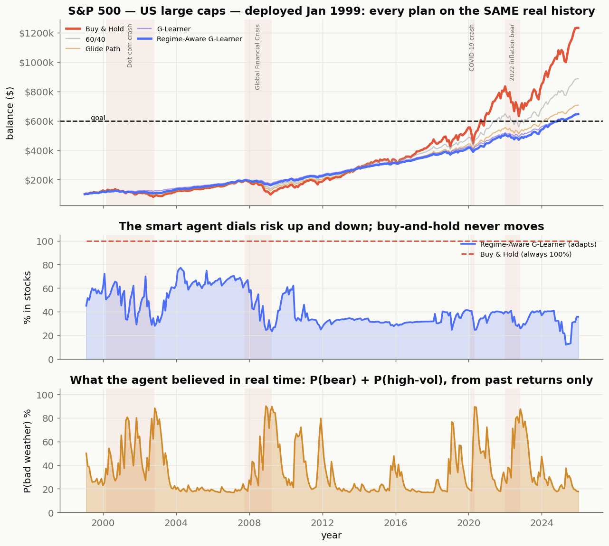

# Regime-Aware Goal-Based Wealth Management — Report

**A goal-based reinforcement-learning simulator for dynamic portfolio allocation
under changing market regimes.**

---

## 1. Problem

Investors have **goals**, not just return preferences: "turn \$100k into \$250k in
20 years, contributing \$500/month." The right objective is therefore the
**probability of reaching the goal**, `P(W_T ≥ G)`, and the expected shortfall
when you miss — not raw expected return. A strategy that reaches the goal by
taking reckless path risk is not acceptable.

## 2. The paper we extend

Dixon & Halperin, *G-Learner and GIRL: Goal Based Wealth Management with
Reinforcement Learning* (arXiv:2002.10990, 2020), pose goal-based wealth
management as a Markov Decision Process solved with **G-learning** — a
probabilistic, entropy-regularized extension of Q-learning that works with an
explicit one-step reward and is robust to noisy data.

## 3. Our extension: market regimes

Real markets switch between regimes — **bull, stable, high-volatility, bear** —
with different drift and volatility. We model the market as a **Markov-switching
GBM** (a hidden regime chain, each regime its own geometric Brownian motion) and
give the agent a **regime-aware** variant that conditions its allocation on an
**HMM belief** over the current regime. This makes the policy *state-dependent*
on three axes — time, wealth gap, and regime — unlike a target-date fund, which
de-risks on time alone.

## 4. Method

| Component | Choice |
|---|---|
| Market model | Multi-asset GBM × 4-regime Markov chain (persistence 0.85; contagion-scaled correlations in stressed regimes) |
| Environment | Custom Gymnasium MDP — state `(time, wealth/goal, gap, regime belief)`, action = risky weights, reward = terminal goal utility − path penalties |
| Classical agent | **G-Learner** (entropy-regularized backward induction; Gibbs policy / free energy) and a **Regime-Aware G-Learner** (per-regime policies mixed by belief — a QMDP approximation) |
| Deep-RL comparators | PPO / SAC (Stable-Baselines3) |
| Regime detection | Gaussian **HMM** (Baum-Welch + forward-backward + Viterbi), feeding an online belief filter |
| Baselines | Buy & Hold, 60/40, linear Glide Path |

The agent observes the regime through an **online Bayes filter** (the honest
POMDP treatment): it never sees the true regime, only a posterior belief updated
from realized returns.

## 5. What the learned policy does (sanity check)

The G-Learner reproduces the textbook goal-based pattern:

- **Behind the goal → take more risk** (only chance to catch up).
- **At/above the goal near the deadline → protect** (cut equity sharply).
- **Regime-aware** equity, same state: **bull ≈ 100% › high-vol › stable › bear ≈ 20%** — it de-risks in bad weather.

## 6. Results (Monte-Carlo, 4,000 paths)

**Default goal — \$100k → \$250k, 20y, \$500/mo (an *easy* goal):**

| Strategy | P(goal) | Avg shortfall | Avg max drawdown |
|---|---:|---:|---:|
| **G-Learner** | **0.98** | \$1.1k | 0.13 |
| Regime-Aware G-Learner | 0.94 | \$3.7k | 0.24 |
| Glide Path | 0.79 | \$10k | 0.35 |
| 60/40 | 0.78 | \$12k | 0.33 |
| Buy & Hold | 0.63 | \$33k | 0.55 |

Both G-Learners **dominate the static baselines** on P(goal) and shortfall. With
an easy goal, a regime-*blind* "gamble when behind / coast when ahead" policy
already nearly maxes P(goal), so regime timing adds little (and some turnover).

**Ambitious goals — where risk-timing matters:**

| Target | Glide Path | G-Learner | **Regime-Aware** |
|---|---:|---:|---:|
| \$400k | 0.40 | 0.56 | **0.58** (lower shortfall) |
| \$550k | 0.17 | 0.23 | **0.24** (lower shortfall *and* drawdown) |

When the goal is hard enough that you cannot simply coast, the **regime-aware**
agent wins on P(goal), reduces expected shortfall, and at the hardest goal also
cuts max drawdown (0.25 vs 0.29) — it reaches the goal with *less* path risk.

## 7. Real-world validation — *deployed in 1999* (honest, out-of-sample)

Monte-Carlo on our own simulator is a sanity check, not proof. The real test:
**roll every strategy over real market history with no look-ahead** — economic-prior
regimes (assumptions you could set on day one, *not* fit to the future) and an
online belief filter that only ever sees past returns. See `HISTORY.md` for the
full study; the headline (S&P 500, \$100k + \$500/mo, goal \$600k, **Jan 1999 → 2025**):

| Strategy | Final | Reached goal | **Max drawdown** |
|---|---:|:--:|---:|
| G-Learner | \$642k | ✅ | **13%** |
| Regime-Aware G-Learner | \$646k | ✅ | **19%** |
| Buy & Hold | \$1,233k | ✅ | **50%** |

Buy & Hold ends richer **only by surviving a 50% crash twice**; the goal-based RL
agents reach the goal with **a third of the drawdown**. The agent's decisions are
sensible *in real time*: it cut equity 65%→25% into the GFC as its bear-belief rose
to 90%. The pattern holds on **NASDAQ** (Buy & Hold −71% vs −26%), **KOSPI** and
**Nikkei**. And on **sequence-of-returns risk** — starting right before a crash —
the regime-aware agent is decisive: deployed in **2007** it took a **16% drawdown
vs Buy & Hold's 48%**, where the regime-*blind* agent (39%) gets caught.



## 8. Interpretation (the mature answer)

Regime-awareness is not free lunch: its value depends on the goal's difficulty
and on whether path risk is penalized. The honest conclusion is that
**goal-based RL clearly beats static strategies**, and **regime-awareness adds
value precisely when timing risk matters** — ambitious goals and adverse-regime
exposure. An RL policy that hit the goal only by gambling would be rejected; here
the regime-aware agent improves outcomes while *lowering* drawdown at hard goals.

## 9. Demo

The Streamlit app lets you set a goal, view the regimes, run the comparison, and
inspect *why* the agent acted — e.g. *"it cut equity 57%→25% because the bear
probability rose 10%→60%."* Move the target slider up and watch the regime-aware
agent overtake the regime-blind one.

## 10. Reproduce

```bash
pip install -e ".[all,dev]"
gbwm evaluate                       # comparison table on the default goal
gbwm train --agent regime_aware_g_learner
gbwm backtest --agent regime_aware_g_learner --seed 7
gbwm history --market sp500 --start 1999-01-01   # honest real-history backtest
python scripts/historical_demo.py                # cross-market + sequence-risk + figures
streamlit run app/streamlit_app.py
```

*Numbers above are seed-dependent Monte-Carlo estimates; rankings are stable. See
`ARCHITECTURE.md` for the system design and decision records.*

## References

- **Main paper.** Dixon, M. F. & Halperin, I. (2020). *G-Learner and GIRL: Goal Based
  Wealth Management with Reinforcement Learning.* arXiv:2002.10990.
- **Regime-switching extension.** Bauman, T., Goluža, S., Gašperov, B. & Kostanjčar, Z.
  (2024). *Deep Reinforcement Learning for Goal-Based Investing Under Regime-Switching.*
  PMLR.
- **Course alignment.** Stanford University Bulletin — *CME 241: Foundations of
  Reinforcement Learning with Applications in Finance.*
- **Alternative considered.** Bühler, H., Gonon, L., Teichmann, J. & Wood, B. (2018).
  *Deep Hedging.* arXiv:1802.03042.
- **Implementation tools.** Farama Gymnasium environment API; Stable-Baselines3 (PPO/SAC).
